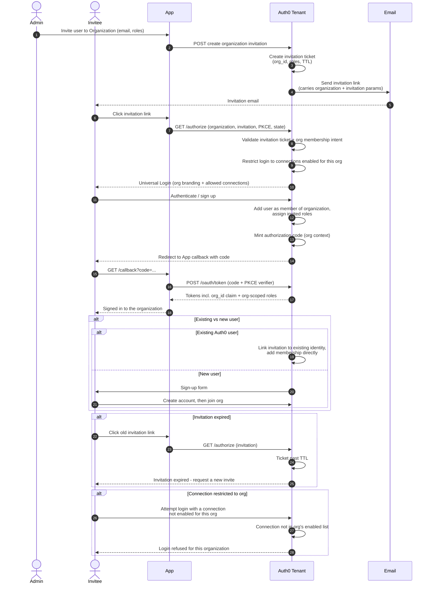

# Auth0 Organizations Invitation — Sequence Diagram

Happy path: admin invites a member, Auth0 emails an invitation ticket, the invitee
accepts, and login proceeds **in the organization context** (the app passes the
`organization` parameter to the standard
[OIDC Authorization Code + PKCE](../../../authentication/oidc/authorization-code-pkce/README.md) flow),
yielding tokens with `org_id` and org-scoped roles. Alternates: existing vs new user,
expiry, connection restricted to org.

