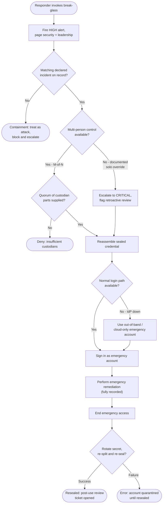

# Break-Glass Emergency Access — Decision Flowchart

The authorization, alerting, and mandatory-reseal gates, with explicit deny and
containment terminals. Note that alerting is unconditional.

Notes

- The alert step has no branch out of it — every invocation is loud, whether or not it is
  later authorized, so the abuse path in `Incident -->|No|` is still noisy.
- The solo-override branch is not a shortcut: it raises the alert severity and forces a
  retroactive review, trading prevention for even stronger detection.
- The reseal gate fails closed: a credential that could not be re-sealed leaves the
  account quarantined rather than silently reusable.
