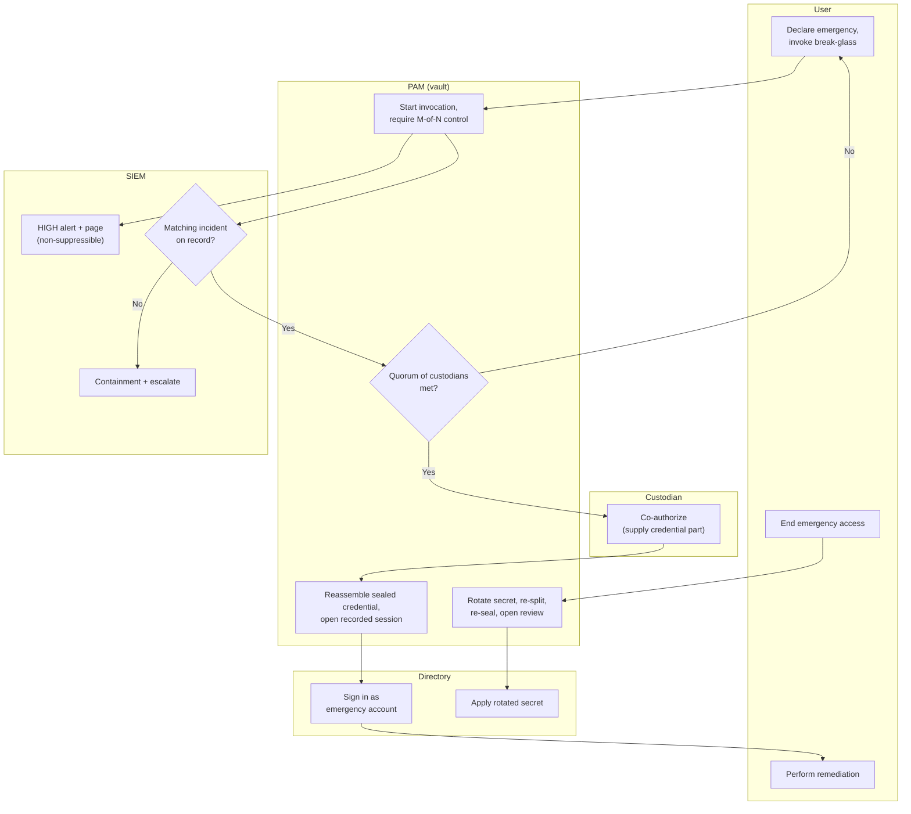

# Break-Glass Emergency Access — Swimlane Diagram

One lane per actor. Alerting runs in parallel with the whole flow, not after it.

Notes

- `M1` (alert / page) branches off the moment invocation starts, independent of whether
  access is ultimately granted — the loud signal is the point.
- `M2 -->|No| M3` is the abuse path: an invocation with no incident is treated as an
  attack and routed to containment instead of the seal.
- `P4`/`D2` are mandatory: no completed break-glass event ends without rotation, reseal,
  and a review ticket.
