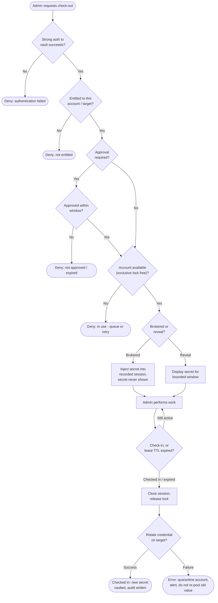

# Credential Vault Check-Out / Check-In — Decision Flowchart

Every gate between "admin wants the credential" and "credential rotated", with explicit
deny and error terminals.

Notes

- The approval and lock gates are independent: an approved request can still be denied at
  the lock if another admin holds the account.
- Both the brokered and reveal branches converge on the same mandatory rotation gate —
  reveal simply makes rotation non-negotiable because a human saw the value.
- Rotation failure terminates in an error state, not back at "available"; failing closed
  is what prevents a stale, known password from being handed out again.
