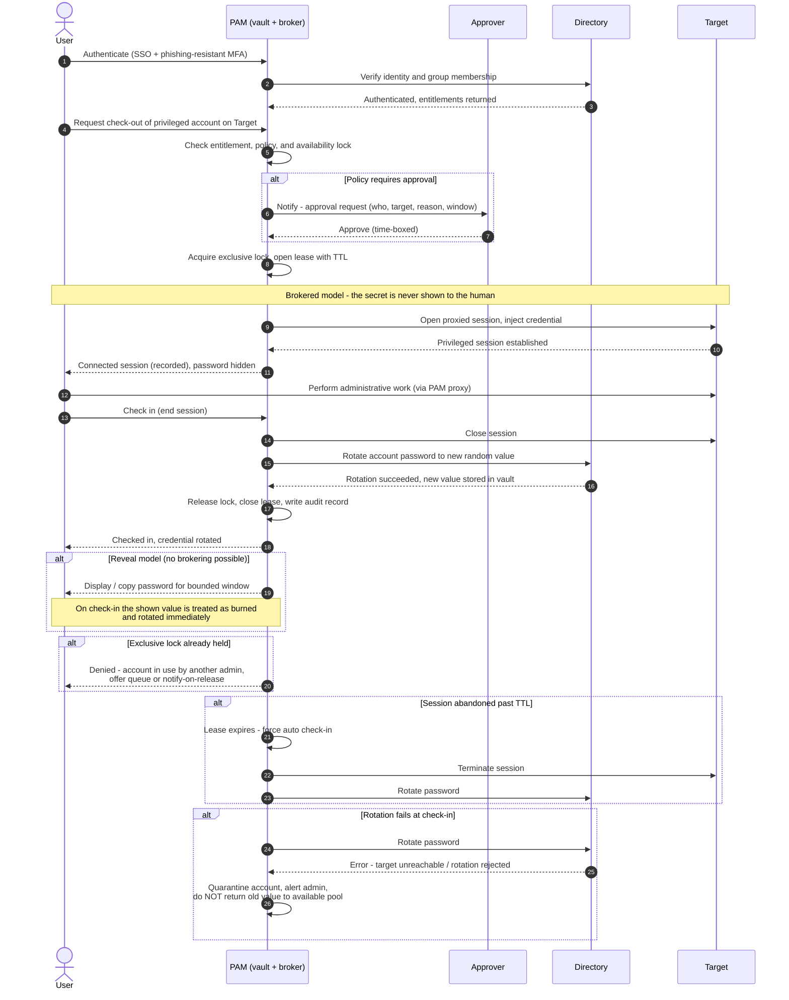

# Credential Vault Check-Out / Check-In — Sequence Diagram

Happy path first (brokered check-out, session, check-in with rotation), then alternates:
approval-required, reveal model, exclusive-lock contention, auto check-in on timeout, and
rotation failure.

Notes

- The exclusive lock (steps around lock acquisition) is what preserves one-human
  accountability for a shared account; concurrent mode drops the lock but attributes
  each session separately.
- In the brokered branch the credential travels PAM to Target only; the User channel
  never carries the secret, which is the main advantage over the reveal model.
- Rotation is the security-critical step: a failed rotation must fail *closed*
  (quarantine), never fall back to leaving the old password valid and available.
