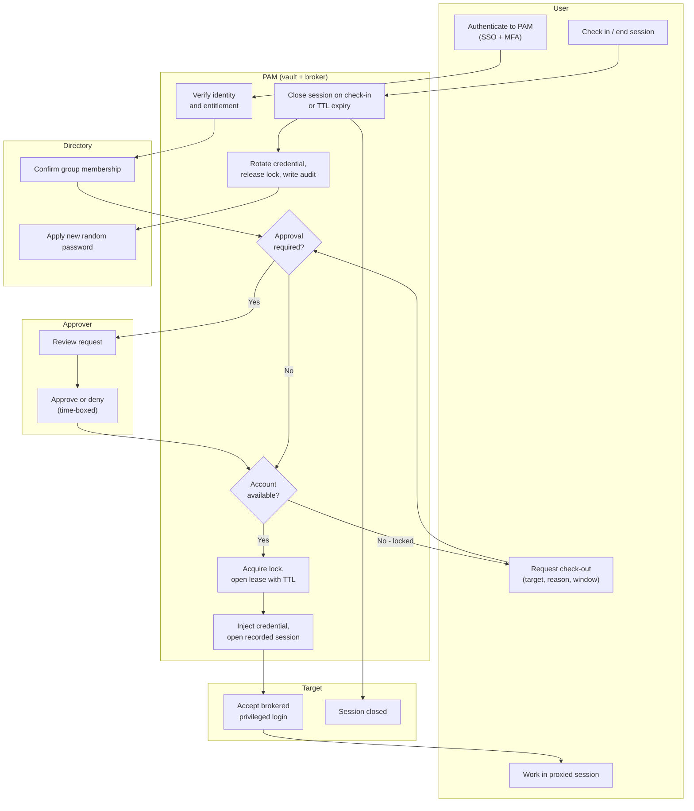

# Credential Vault Check-Out / Check-In — Swimlane Diagram

One lane per actor. The brokered path keeps the secret on the PAM-to-Target hop only.

Notes

- The `P3 -->|No - locked| U2` edge is the exclusive-lock contention path: the admin is
  bounced back to request again later (or queue).
- Auto check-in on TTL expiry enters `P6` without a `U4` check-in, so rotation still runs
  even when the human walks away.
- Directory here doubles as the account store being rotated (`D2`); for local accounts
  the Target itself would host that step.
