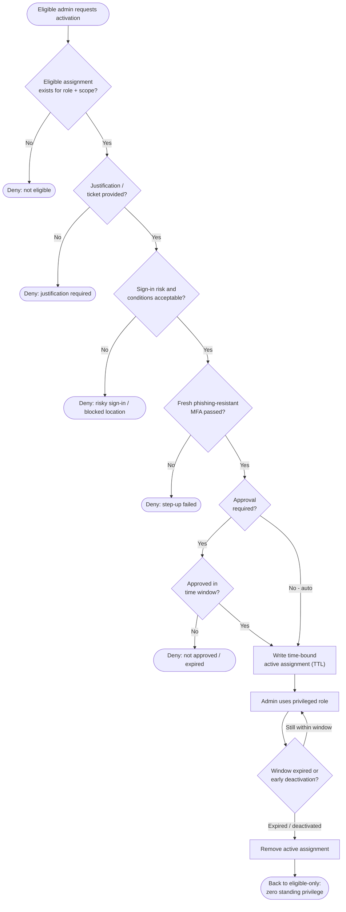

# Just-In-Time Privilege Elevation — Decision Flowchart

Every gate between an eligible identity and an active, time-bound role, plus the
auto-revoke back to zero standing privilege.

Notes

- The gates are ordered cheap-to-expensive: eligibility and justification are checked
  before the interactive MFA and approval steps.
- Every deny terminal leaves standing state untouched — a denied activation never grants
  anything, so the resting posture is always unprivileged.
- The `Use` self-loop plus the single `Revoke` exit models both natural expiry and early
  deactivation converging on the same guaranteed return to zero standing privilege.
