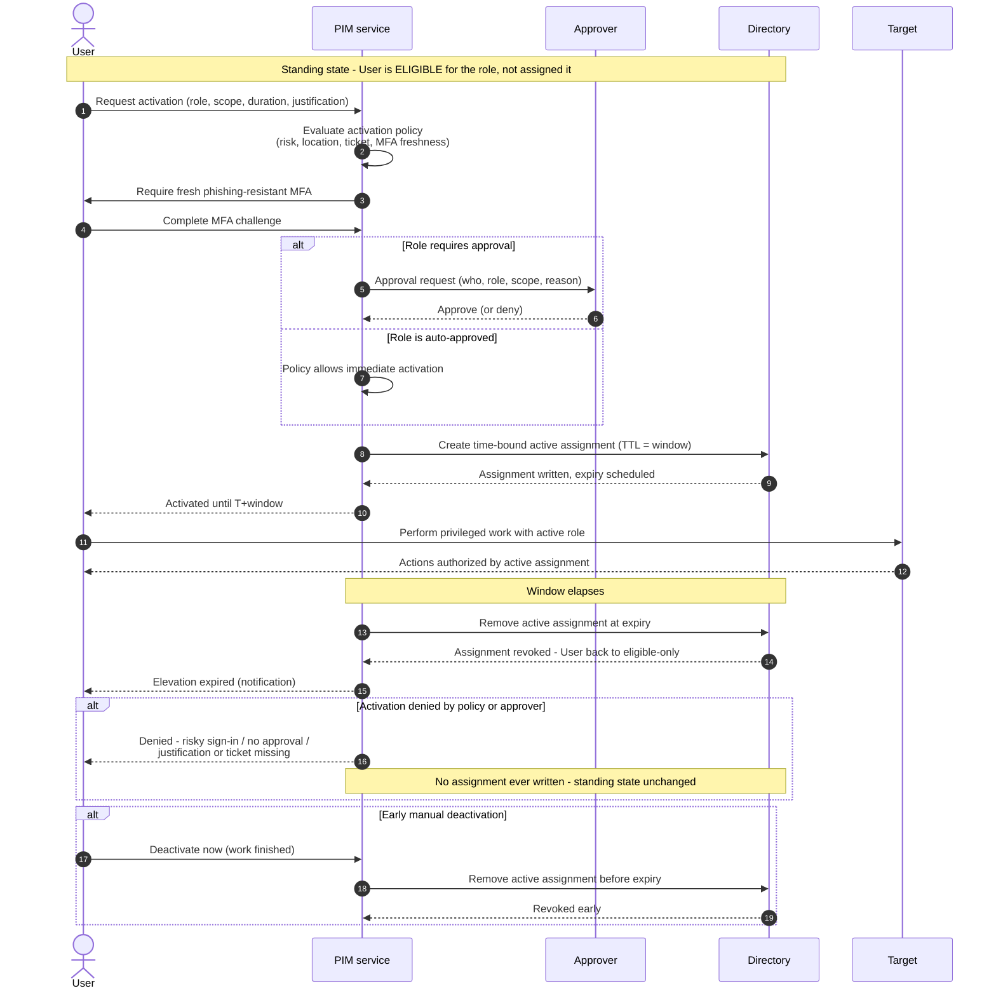

# Just-In-Time Privilege Elevation — Sequence Diagram

Happy path first (approval-required activation, use, auto-revoke), then alternates:
auto-approved activation, denied activation, and early manual deactivation.

Notes

- The persistent eligible assignment is the pre-condition, not part of the timed flow;
  the timed assignment (`create ... TTL` to `remove at expiry`) is what actually confers
  privilege.
- Fresh MFA is demanded at activation regardless of session age — the activation event is
  where access is granted.
- Auto-revoke fires from the scheduled expiry with no user turn, which is the property
  that guarantees no lingering standing privilege.
