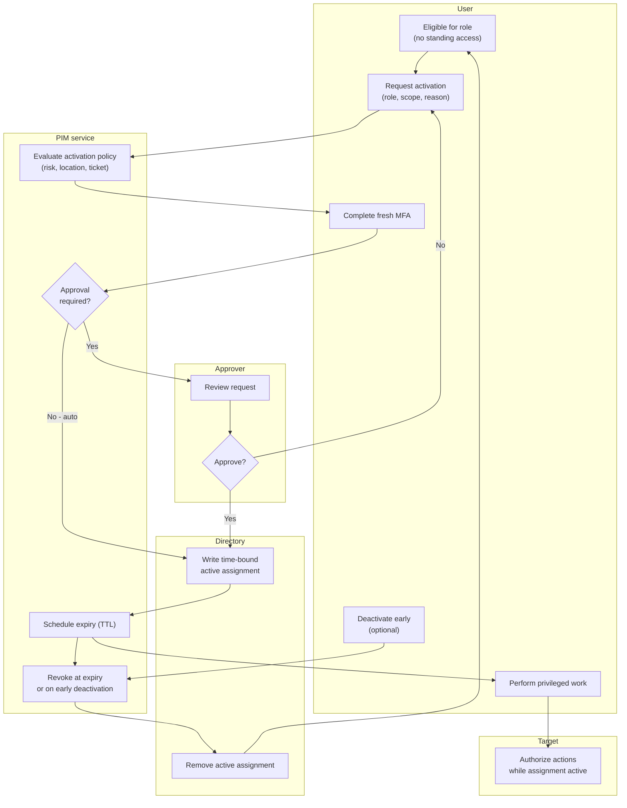

# Just-In-Time Privilege Elevation — Swimlane Diagram

One lane per actor. The eligible-only resting state and the auto-revoke return to it
bookend the flow.

Notes

- `A2 -->|No| U1` and a policy fail inside `M1` are the deny paths; neither writes an
  assignment, so the User stays in the eligible-only state `U0`.
- Both the timed expiry from `M3` and the optional early deactivation `U4` route through
  the same revoke step `M4`, returning the User to `U0`.
- `D1`/`D2` are the only writes to standing state — everything the User does in `U3`/`T1`
  is scoped to the lifetime of that single assignment.
