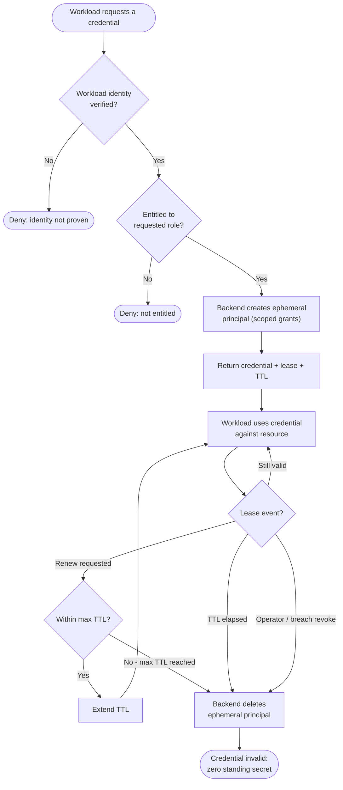

# Secrets Broker with Dynamic Credentials — Decision Flowchart

From a workload's request to a leased credential, and the lease lifecycle that ends in
guaranteed revocation. Every terminal either denies or tears the credential down.

Notes

- The two gates (`AuthN`, `Pol`) are checked before anything is minted, a denied request
  never touches the backend, so failure leaves no residue.
- The `Cap` diamond enforces the hard ceiling: renewal can extend a lease only up to
  `max TTL`, after which the credential is revoked and the workload must start over at `S`.
- Every non-deny exit converges on `Revoke --> Dead`, so whether by expiry, max-TTL, or
  manual action the credential always ends invalid — there is no path that leaves a standing
  secret behind.
