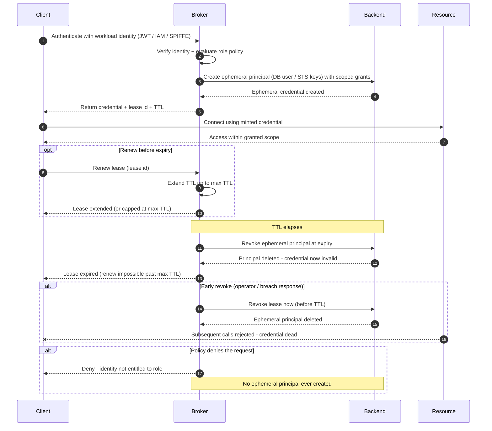

# Secrets Broker with Dynamic Credentials — Sequence Diagram

Happy path first (authenticate, mint a leased short-lived credential, use it, auto-revoke
at expiry), then lease renewal, early revoke, and policy-denial alternates.

Notes

- The broker authenticates the **workload**, not a human, the whole flow is machine-to-service
  and no operator ever handles the secret.
- The credential exists only between the backend `create` and its matching `revoke`, so the
  lease + TTL, not rotation, is what bounds exposure.
- Auto-revoke at expiry fires from the broker's own timer with no client turn, which is the
  property that guarantees no orphaned standing credential.
