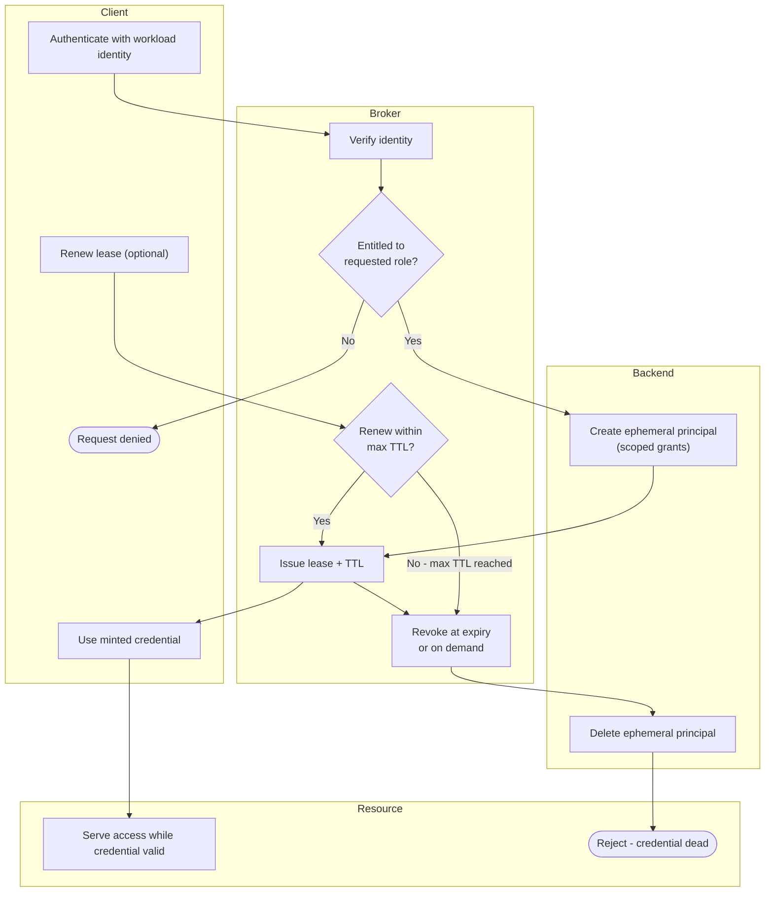

# Secrets Broker with Dynamic Credentials — Swimlane Diagram

One lane per actor. The Broker lane owns the lease lifecycle; the Backend lane is where the
ephemeral principal is created and later destroyed.

Notes

- `B2` is the entitlement gate, a denial ends at `C4` and no ephemeral principal is ever
  created in the Backend lane.
- Every credential in the Resource lane traces to exactly one `K1` create and one `K2`
  delete, so per-lease attribution and instant revocation both fall out for free.
- Renewal (`B4`) loops back to extend the same lease until the hard `max TTL`, after which
  the only path forward is a brand-new request from `C1`.
