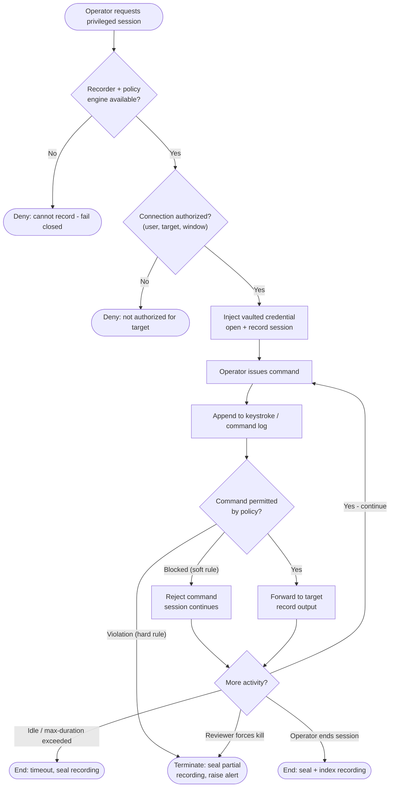

# Privileged Session Recording and Monitoring — Decision Flowchart

The gates between an operator and a target, and the per-command loop that can block or
terminate a live session. Recording availability is itself a gate — no recorder, no
session.

Notes

- The `Rec` gate encodes fail-closed recording: if the session cannot be captured it is
  never opened, so there is no such thing as an unrecorded privileged session.
- Soft-rule matches (`Block`) reject a single command but keep the session alive, while
  hard-rule matches and reviewer kills route to the same `Term` terminal that seals a
  partial recording and alerts.
- Every exit — `Term`, `Timeout`, `Done` — seals the recording, so no path leaves an
  unsealed or missing audit trail.
