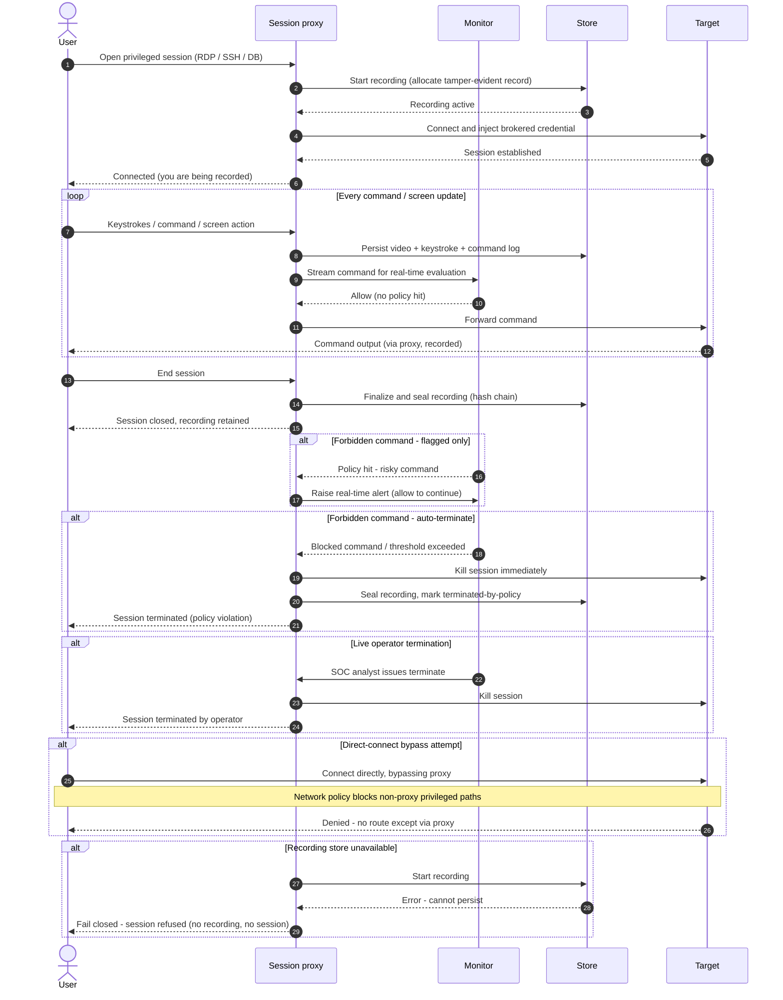

# Privileged Session Recording & Monitoring — Sequence Diagram

Happy path first (proxied, fully recorded, clean session), then alternates:
forbidden-command flag, auto-termination, live operator kill, direct-connect bypass, and
recording-store failure.

Notes

- Recording starts *before* the target connection is completed, so no privileged activity
  can occur before capture is live.
- The `loop` shows the inline decision point: every command is both persisted and
  evaluated, which is what makes real-time termination possible.
- The store-failure alternate defaults to fail-closed; a monitor-only deployment could
  instead continue degraded with a high-severity alert, a deliberate risk trade-off.
