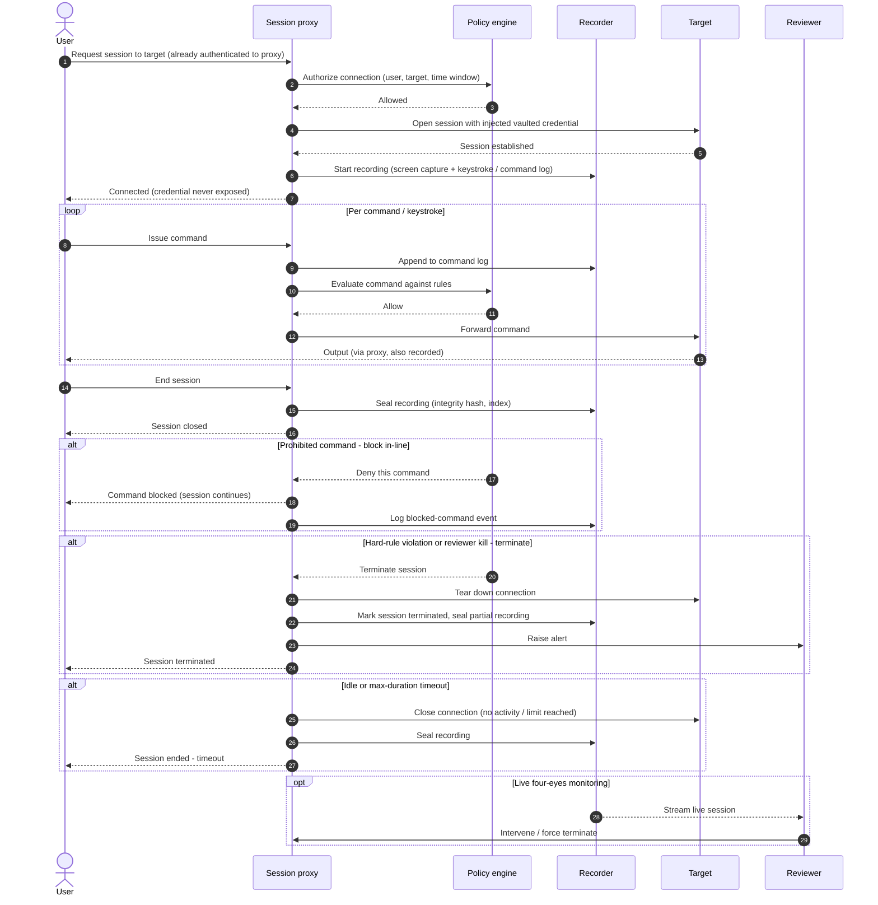

# Privileged Session Recording and Monitoring — Sequence Diagram

Happy path first (brokered session, per-command policy, sealed recording), then the
in-line block, mid-stream termination, and idle-timeout alternates, plus optional live
four-eyes monitoring.

Notes

- The operator authenticates to the **proxy**, not the target, so the vaulted credential is
  injected server-side and never leaves the proxy — that is what makes shared target
  accounts attributable.
- The per-command loop is the enforcement heart, every keystroke is logged **before** the
  policy verdict, so even a blocked or terminated action is captured as evidence.
- Sealing on every exit path (normal, terminated, timeout) means a partial session is still
  a tamper-evident record, not a gap.
