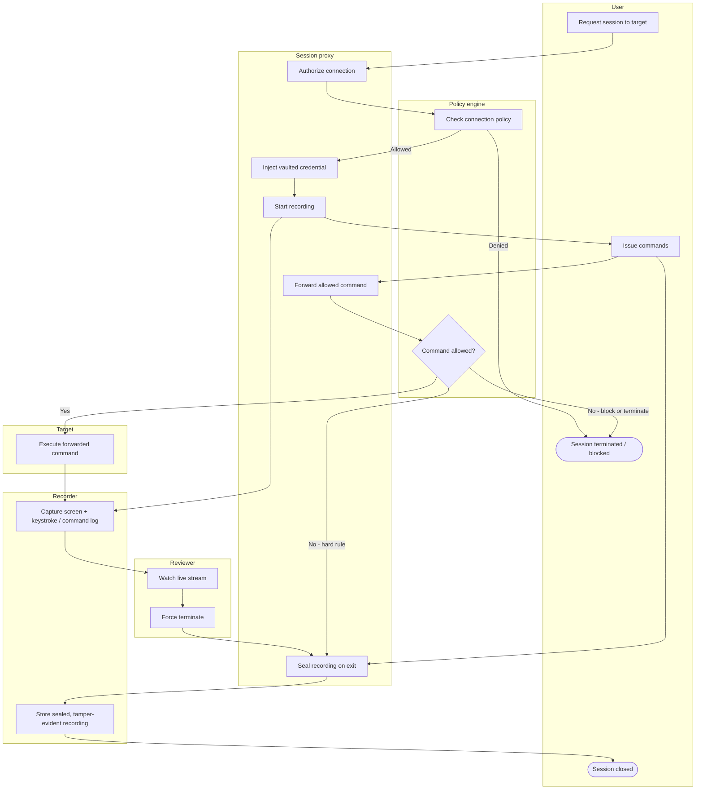

# Privileged Session Recording and Monitoring — Swimlane Diagram

One lane per actor. The Proxy lane is the inline broker: everything the User does reaches
the Target only after passing through it, and every action is mirrored to the Recorder.

Notes

- `Y1` (connection) and `Y2` (per-command) are the two gates, a deny at either lands in the
  terminal `U4` without the command reaching the Target.
- The Recorder lane receives both the User's keystrokes and the Target's output via the
  Proxy, so the sealed artifact `R2` is a complete two-sided transcript.
- The Reviewer lane taps the live stream `R1` and can drive `V2 --> P5` to terminate,
  modelling live four-eyes intervention rather than after-the-fact review only.
