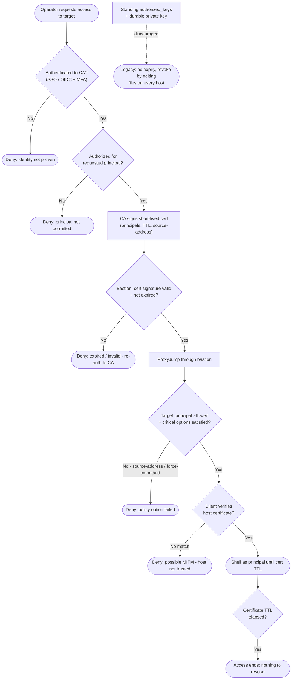

# SSH Bastion / Jump Host — Decision Flowchart

From an access request to an authenticated shell, showing the certificate-issuance gate,
the per-hop validation gates, and the discouraged standing-key branch.

Notes

- Two validation diamonds (`BasChk`, `TgtChk`) enforce the certificate at both hops; a cert
  that clears the bastion still dies at the target if the principal or a critical option
  fails.
- The `Expire` gate is the revocation model — access ends by the TTL lapsing, so `Gone` has
  nothing to clean up, unlike the standing-key `Legacy` branch.
- `HostChk` makes trust mutual: a failed host-certificate match terminates in `DenyHost`
  rather than a blind trust-on-first-use prompt.
