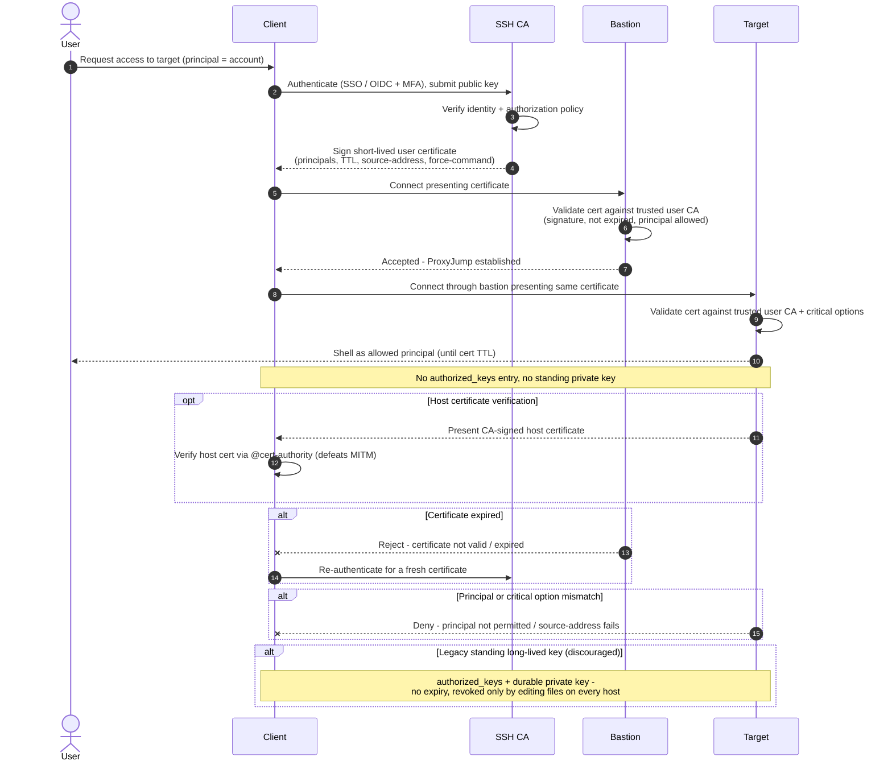

# SSH Bastion / Jump Host — Sequence Diagram

Happy path first (authenticate to CA, sign short-lived cert, jump through the bastion to
the target), then expired-certificate, principal-mismatch, and the discouraged standing-key
alternates, plus optional host-certificate verification.

Notes

- Identity is proven **once** to the CA, everything downstream is stateless certificate
  validation, the bastion and target hold only the CA public key, never per-user secrets.
- The same ephemeral certificate authenticates to both the bastion and the target, its
  short TTL is the revocation mechanism, so there is nothing to clean up when it lapses.
- Host certificates (the `opt` block) make trust mutual, the client verifies the target is
  genuine rather than accepting a first-seen host key blindly.
