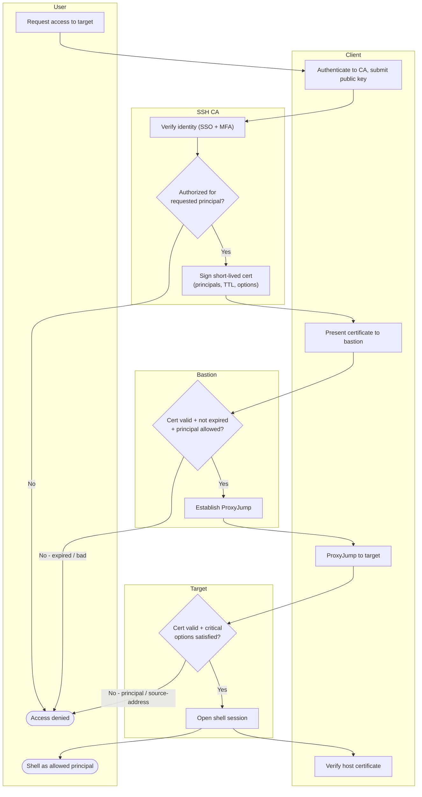

# SSH Bastion / Jump Host — Swimlane Diagram

One lane per actor. The CA lane mints the ephemeral certificate; the Bastion and Target
lanes only validate it against the trusted CA — neither holds a per-user secret.

Notes

- The only place a durable secret lives is the **CA** lane (`A3` signing key), the Bastion
  and Target lanes carry only the CA public key and make stateless yes/no decisions.
- Two independent validations (`B1` at the bastion, `T1` at the target) mean the certificate
  is checked at every hop, a cert good for the bastion still fails at the target if the
  principal is wrong.
- `C4` (host-cert verification) closes the loop so trust is mutual rather than the client
  trusting whatever host answers.
