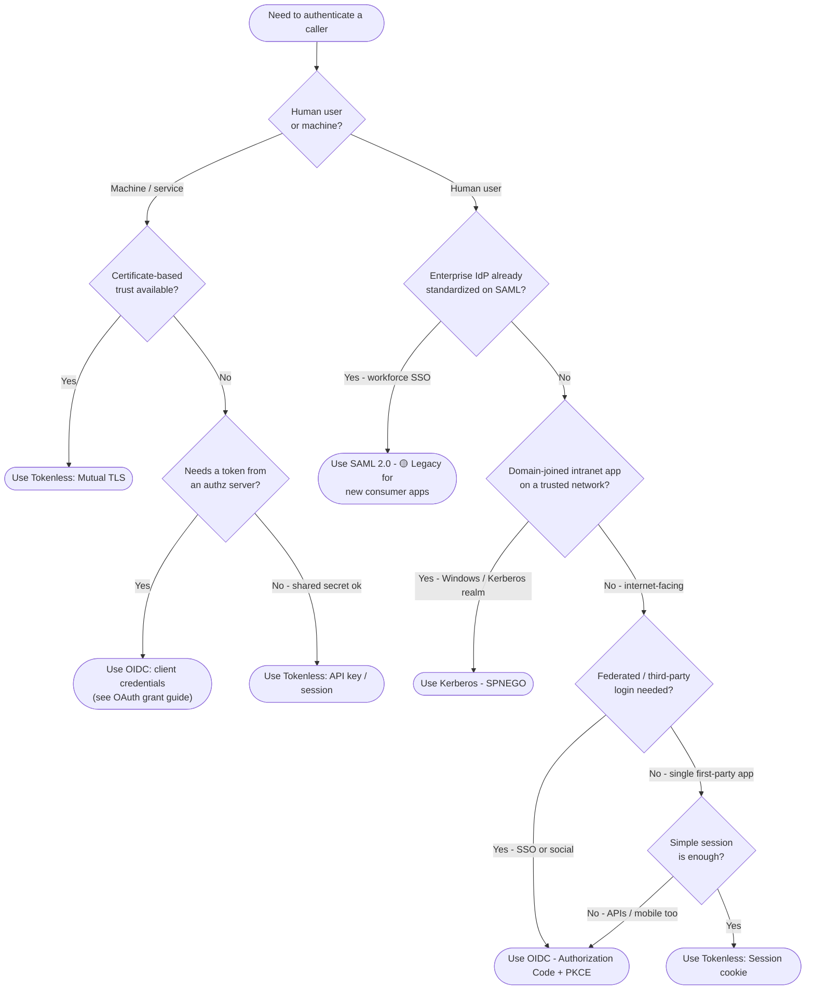

# Choosing an Authentication Protocol — Decision Tree

Leaves are rounded nodes naming the recommended protocol. Selection criteria are diamonds.

Leaf links

- **Use OIDC - Authorization Code + PKCE** → [`../../oidc/authorization-code-pkce/`](../../../authentication/oidc/authorization-code-pkce/README.md)
- **Use OIDC: client credentials** → [`../../oidc/client-credentials/`](../../../authentication/oidc/client-credentials/README.md) (and the [OAuth grant guide](../choosing-an-oauth-grant/README.md))
- **Use SAML 2.0** → [`../../saml/sp-initiated-sso/`](../../../authentication/saml/sp-initiated-sso/README.md)
- **Use Kerberos - SPNEGO** → [`../../kerberos/spnego-http/`](../../../authentication/kerberos/spnego-http/README.md)
- **Use Tokenless: Mutual TLS** → [`../../tokenless/mutual-tls/`](../../../authentication/tokenless/mutual-tls/README.md)
- **Use Tokenless: Session cookie** → [`../../tokenless/session-cookie/`](../../../authentication/tokenless/session-cookie/README.md)
- **Use Tokenless: API key / session** → [`../../tokenless/session-cookie/`](../../../authentication/tokenless/session-cookie/README.md)
