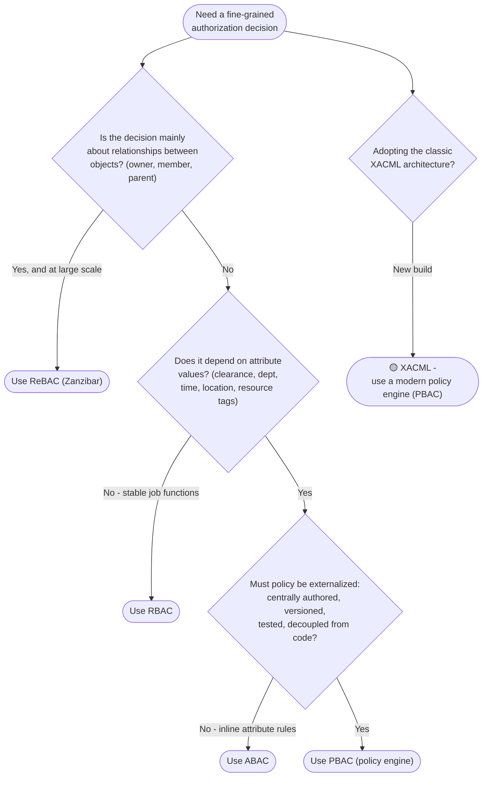

# Choosing an Authorization Model — Decision Tree

Leaves name the recommended model; the legacy standard is 🟡 with its replacement.

Leaf links

- **Use RBAC** → [`../../authorization/rbac/`](../../../authorization/rbac/README.md)
- **Use ABAC** → [`../../authorization/abac/`](../../../authorization/abac/README.md)
- **Use ReBAC (Zanzibar)** → [`../../authorization/rebac-zanzibar/`](../../../authorization/rebac-zanzibar/README.md)
- **Use PBAC (policy engine)** → [`../../authorization/pbac-policy-engine/`](../../../authorization/pbac-policy-engine/README.md)
- **🟡 XACML** → replacement [`../../authorization/pbac-policy-engine/`](../../../authorization/pbac-policy-engine/README.md) (reference: [`../../authorization/xacml-pdp-pep/`](../../../authorization/xacml-pdp-pep/README.md))
