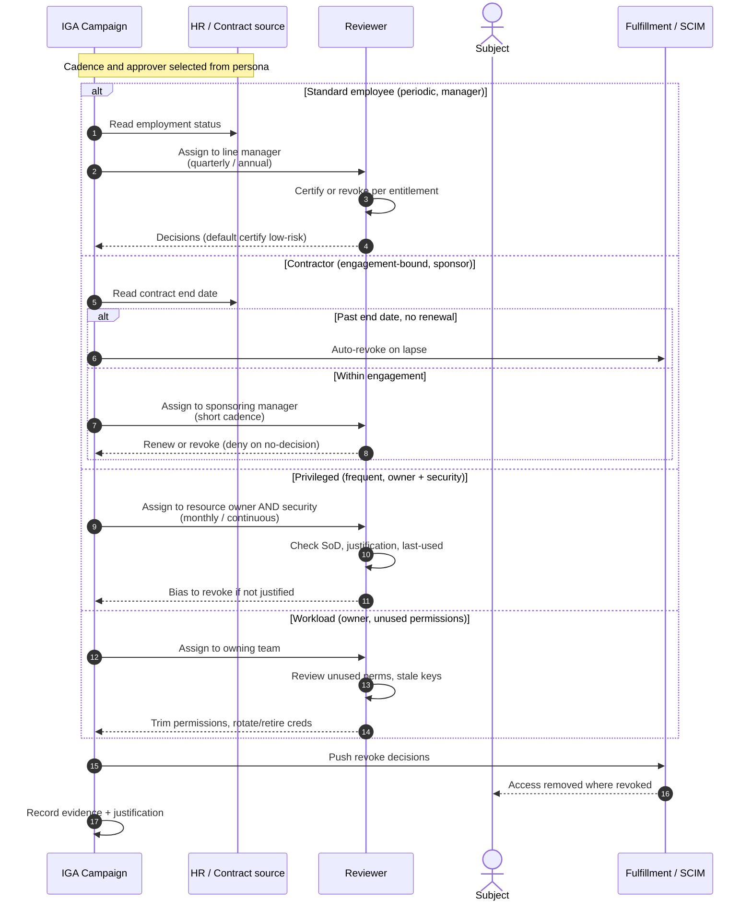

# Access Review by Persona — Sequence Diagram

The persona is resolved first, then each `alt` branch shows the cadence, approver, and default
decision for that persona. Branches reference the base certification flow rather than redrawing
it.

Notes

- The persona sets three things at once: **how often** the campaign runs, **who** attests, and
  **what happens on no-decision** (certify-lean for standard, revoke-lean for contractor and
  privileged).
- Contractor access can be revoked with **no reviewer step at all** when the contract end date
  has passed — the source of truth, not a human, drives it.
- Privileged is the only branch requiring **two approvers** (resource owner and security) and an
  explicit last-used/justification check.

Related: [README](./README.md) | [Swimlane](./swimlane.md) | [Flowchart](./flowchart.md)
