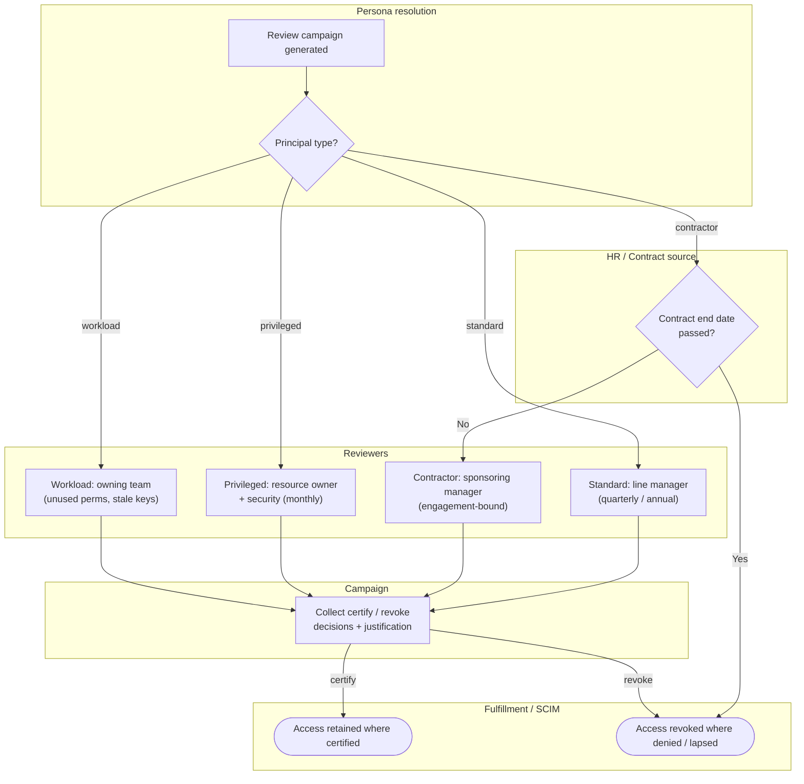

# Access Review by Persona — Swimlane Diagram

A router lane resolves the persona; each persona then flows through its own cadence and
approver before decisions reach shared fulfillment.

Notes

- The Contractor lane can shortcut straight to revocation via the Source lane (`H1`) when the
  engagement has ended — no reviewer is consulted.
- The Privileged lane is the only one naming two reviewers; its default decision leans to
  revoke, which is why more of its edges reach `F2`.
- All personas converge on the same fulfillment lane, so the fork is entirely in *who reviews,
  how often, and the default* — not in how a revocation is executed.

Related: [README](./README.md) | [Sequence](./sequence.md) | [Flowchart](./flowchart.md)
