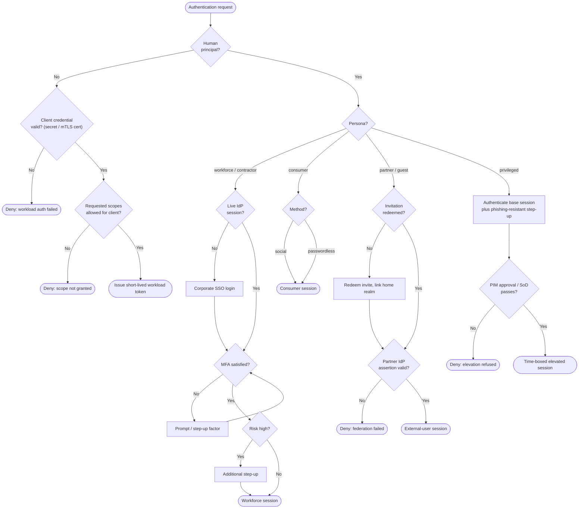

# Authentication by Persona — Decision Flowchart

Branch on principal type first, then on the persona-specific decisions each path must make.
Terminal states are the resulting session (or a denial).

Notes

- The first diamond (`Human?`) is the hard fork: non-human principals never reach MFA, risk,
  or step-up — they succeed or fail on credential and scope validation alone.
- Privileged is the only human leaf gated by a **second** authority (PIM) after the IdP, and
  its success state carries an expiry, not a standing role.
- Partner and Guest share the redeem-then-federate shape; they diverge later in lifecycle and
  authorization, not at authentication.

Related: [README](./README.md) | [Sequence](./sequence.md) | [Swimlane](./swimlane.md)
