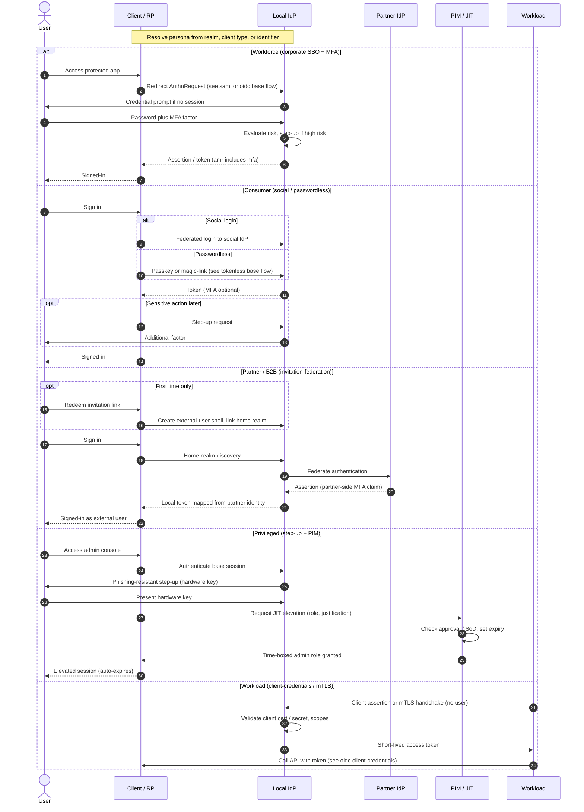

# Authentication by Persona — Sequence Diagram

The persona is resolved first, then each `alt` branch shows how that persona authenticates.
Branches reference their base flow rather than redrawing the full handshake.

Notes

- The `amr` / `AuthnContextClassRef` claim is what lets the Client tell a genuine MFA login
  from an unauthenticated one — persona name alone proves nothing.
- Privileged is deliberately two steps: a normal authenticated session, then a **separate**
  just-in-time elevation with its own expiry, so standing admin never exists.
- The Workload branch has no `User` actor and no MFA — that absence is the whole point of the fork.

Related: [README](./README.md) | [Swimlane](./swimlane.md) | [Flowchart](./flowchart.md)
