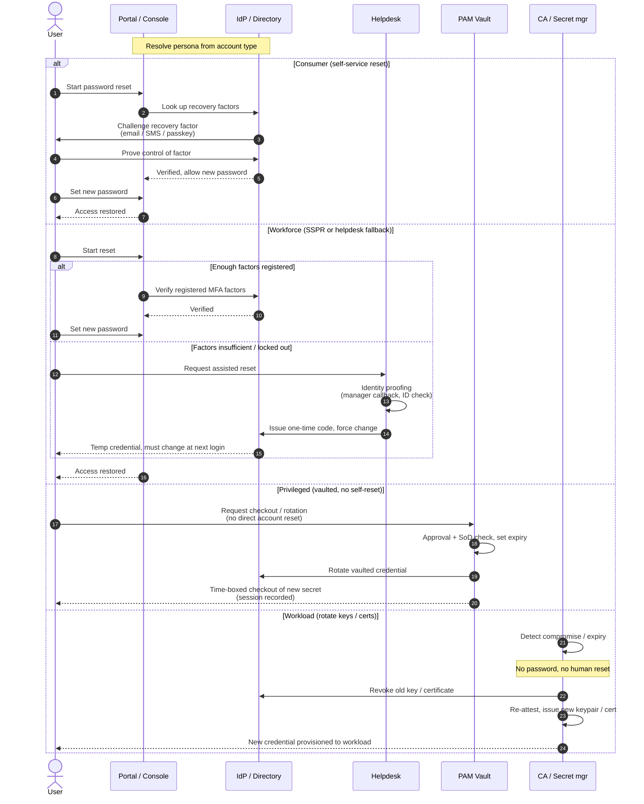

# Credential Recovery by Persona — Sequence Diagram

The persona is resolved first, then each `alt` branch shows how that persona recovers access.
Branches reference their base flow rather than redrawing it.

Notes

- The consumer and workforce paths converge on "set a new password", but the workforce path
  adds a **proofed helpdesk fallback** that the consumer path deliberately lacks.
- Privileged recovery is **not** a reset: the holder never learns a resettable password; the
  vault rotates and checks out the secret under approval and recording.
- The workload branch has no `User`-driven step and no password — recovery is revoke-and-reissue
  bound to attestation.

Related: [README](./README.md) | [Swimlane](./swimlane.md) | [Flowchart](./flowchart.md)
