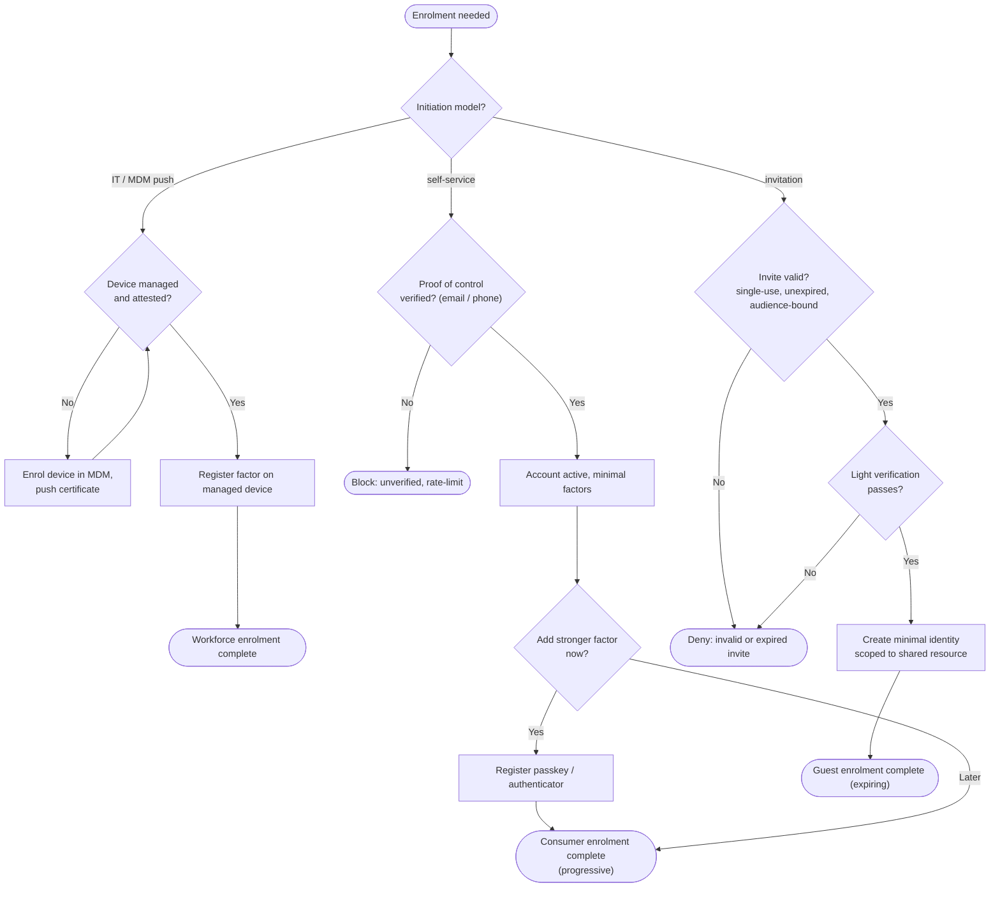

# Enrollment by Persona — Decision Flowchart

Branch on how enrolment is initiated, then apply the trust check that persona requires before
a factor is registered.

Notes

- The initiation diamond is the fork: push (workforce), pull (consumer), or invite (guest).
- Workforce cannot complete until the device is managed and attested; that gate is what makes
  its factors trustworthy for later high-assurance auth.
- Consumer has an explicit "later" branch — progressive enrolment is a first-class outcome, not
  an incomplete one.

Related: [README](./README.md) | [Sequence](./sequence.md) | [Swimlane](./swimlane.md)
