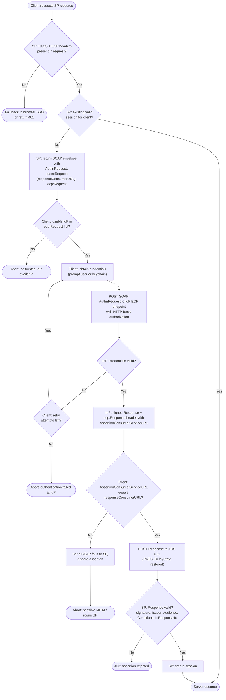

# ECP Profile — Decision Flowchart

Decision gates across all three parties: SP capability negotiation, IdP authentication
with bounded retries, the client's mandatory URL-match check, and SP assertion
validation.

Notes

- The `Match` gate is the profile's signature security control: only the client can
  detect that the SP that started the flow is not the SP the IdP addressed.
- Credential retries must be bounded and rate-limited client-side; the IdP should also
  throttle its ECP endpoint (Basic-auth endpoints attract password spraying).
- The `Hdr -> No` branch is how one URL serves both browsers and ECP clients: content
  negotiation via the `Accept`/`PAOS` headers.
