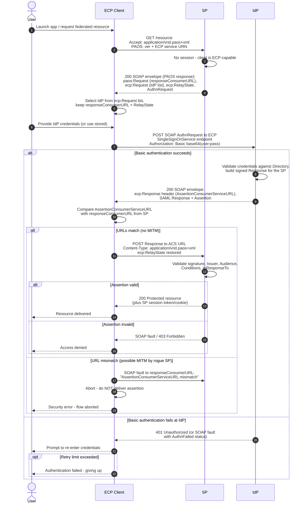

# ECP Profile — Sequence Diagram

Happy path: an ECP-capable client fetches a protected SP resource via the reverse-SOAP
(PAOS) exchange, authenticating to the IdP with HTTP Basic. Alt blocks: Basic-auth
failure at the IdP, and the mandatory `responseConsumerURL` mismatch abort.

Notes

- Steps 2–4 are "reverse SOAP": the SOAP request (`AuthnRequest`) travels inside an
  HTTP *response* to the client — that inversion is what PAOS provides.
- The client is an active protocol participant (unlike a browser): it parses SOAP,
  selects the IdP, authenticates directly, and enforces the URL-match check.
- `ecp:RelayState` from step 4 must be returned verbatim in step 12 so the SP can
  restore request context.
