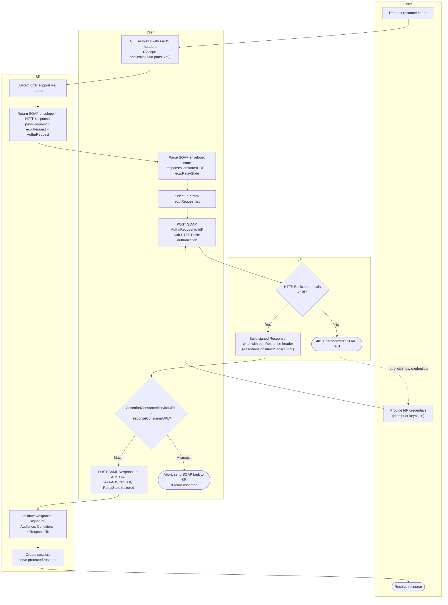

# ECP Profile — Swimlane Diagram

Lanes for User, Client, SP, IdP. The Client lane is unusually busy — in ECP the client
performs work a browser never does: SOAP parsing, IdP selection, direct authentication,
and the anti-MITM URL comparison.

Notes

- No Browser lane exists — the Client replaces it and adds the trust decisions
  (`C5`) the browser profile delegates to the SP/IdP.
- The `I3` retry loop is bounded by client policy; see [flowchart.md](flowchart.md)
  for the give-up terminal.
