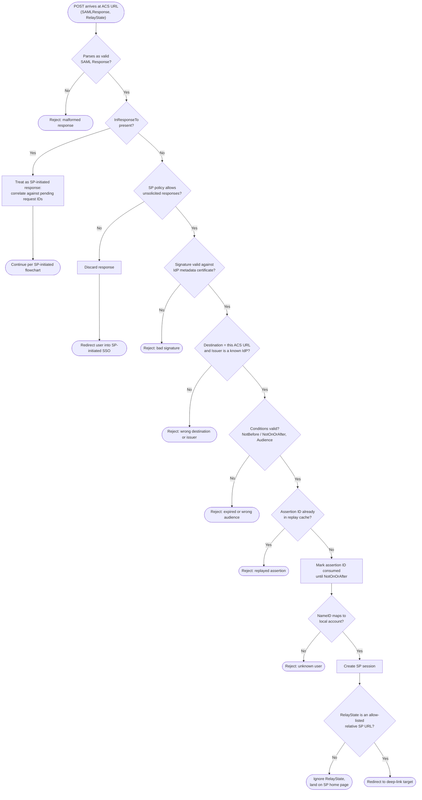

# IdP-Initiated SSO — Decision Flowchart

SP-side acceptance policy and validation for an unsolicited `Response`. The
distinguishing gates are the unsolicited-policy check and the replay cache, which must
compensate for the missing `InResponseTo`.

Notes

- The `HasIrt` gate lets one ACS endpoint serve both flows safely: responses carrying
  `InResponseTo` are always correlated, never treated as unsolicited.
- The `RelayState` gate downgrades gracefully to the home page rather than failing the
  login — the session is already legitimate; only the redirect target is suspect.
- Because login-CSRF cannot be fully eliminated in this profile, security-sensitive SPs
  should choose the `Policy -> No` branch and support IdP tiles via SP-initiated deep links.
