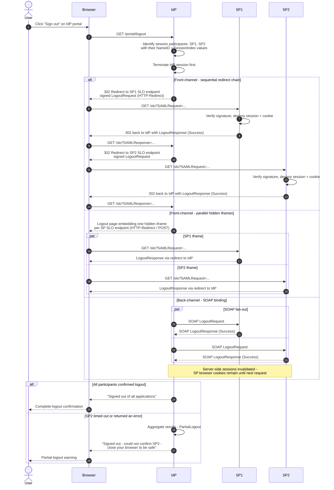

# IdP-Initiated Single Logout — Sequence Diagram

Happy path: user signs out at the IdP portal; the IdP fans out `LogoutRequest`s to both
session participants and reports success. Alt blocks contrast front-channel (redirect /
iframe) with back-channel SOAP, and show partial logout when one SP fails.

Notes

- There is no final `LogoutResponse` to an initiating SP — the IdP started the flow, so
  it just renders the aggregate result to the user.
- The iframe variant is faster than the chain but loses confirmations whenever browsers
  block third-party frames or cookies; treat missing responses as failures.
- Back-channel SPs must validate sessions server-side on every request, since the SLO
  could not clear the browser cookie.
