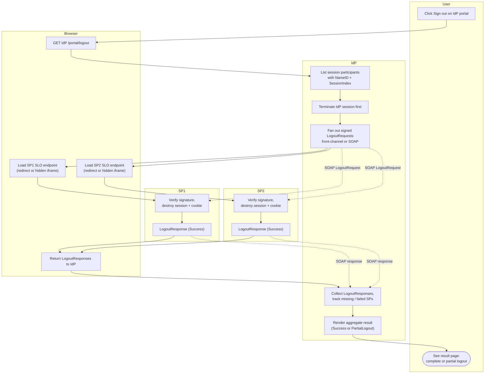

# IdP-Initiated Single Logout — Swimlane Diagram

Lanes for User, Browser, IdP, SP1, SP2. Front-channel fan-out shown solid; the
back-channel SOAP variant is dotted (bypasses the Browser lane).

Notes

- In the back-channel variant (dotted), SP cookies survive; SP1/SP2 must invalidate
  sessions server-side so the stale cookie is useless on the next request.
- If either `P2`/`Q2` never reaches `I4` (blocked iframe, timeout), the flow still
  completes but `I5` reports partial logout — see [flowchart.md](flowchart.md).
