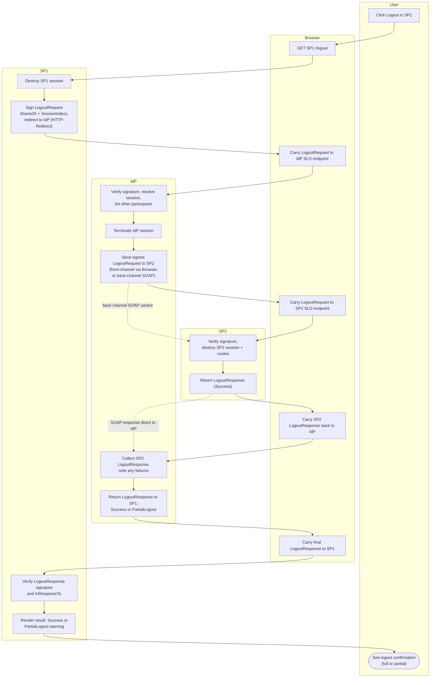

# SP-Initiated Single Logout — Swimlane Diagram

Lanes for User, Browser, SP1 (initiator), IdP, SP2 (other participant). Shown with
front-channel propagation; the back-channel variant replaces the Browser hops to SP2
with a direct IdP-to-SP2 SOAP call.

Notes

- Solid arrows through the Browser lane are the front-channel chain; dotted arrows are
  the back-channel SOAP shortcut that bypasses the browser entirely.
- With more participants, the `I3 -> ... -> I4` segment repeats per SP.
- See [flowchart.md](flowchart.md) for how the IdP decides between Success and
  PartialLogout.
