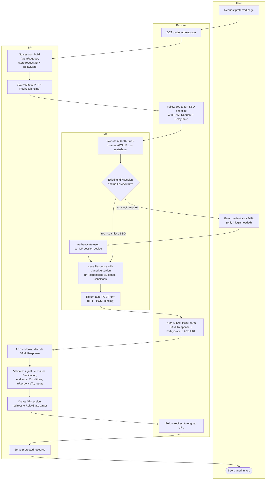

# SP-Initiated SSO — Swimlane Diagram

One lane per actor. Arrows crossing lanes are front-channel handoffs through the browser.

Notes

- Seamless SSO is the `I2 --> I4` shortcut: the IdP session cookie satisfies the
  request without user interaction.
- `ForceAuthn="true"` disables that shortcut, always routing through `U2`/`I3`.
- Validation failures branch out of `S4`; see [flowchart.md](flowchart.md) for the
  full decision tree and error terminals.
