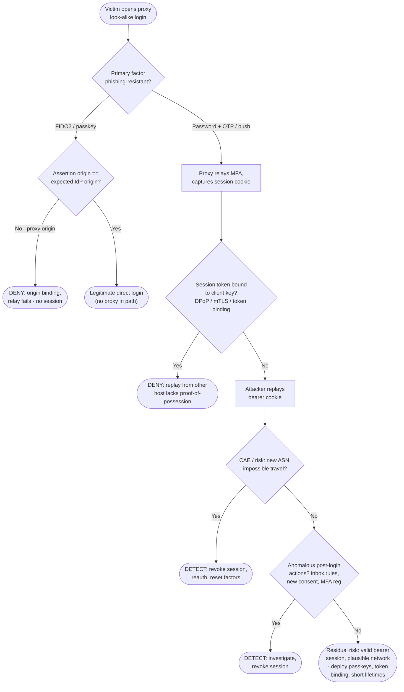

# AiTM MFA Phishing — Decision Flowchart

Where each control forces a **deny** (prevention) or **detect** terminal. The relayed MFA always
succeeds — so defense depends on origin binding and token binding, not on the second factor.

Notes

- **Origin binding** (`OriginQ`) is the only control that stops AiTM before a session exists;
  everything to the right assumes a session cookie was already issued.
- **Token binding** (`BindQ`) neutralizes the stolen cookie by making it non-replayable off the
  victim's host — the second strongest control after passkeys.
- The `Gap` terminal is honest about residual risk: a bearer session replayed from a
  victim-like network with quiet behavior can evade risk scoring, which is why phishing-resistant
  auth and sender-constrained tokens are the durable fixes.
