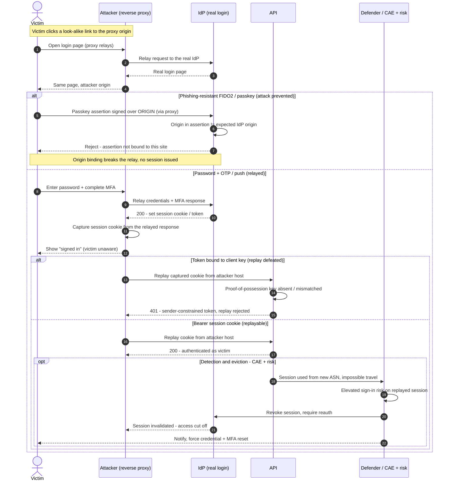

# AiTM MFA Phishing — Sequence Diagram

The attack path (reverse-proxy relays the real login, captures the post-MFA session cookie, then
replays it), then the defenses that prevent it (origin-bound FIDO2) or defeat replay (token
binding, CAE). The **Attacker** is the reverse proxy in the middle.

Notes

- The MFA challenge the victim solves is **real** — relayed through the proxy — which is why OTP
  and push do not stop AiTM; only **origin-bound** FIDO2/passkey does.
- Prevention is the first `alt` (passkey origin check); if a bearer cookie is issued, **token
  binding** makes it non-replayable and **CAE** evicts it fast on risk.
- The captured artifact is a live **session**, so the response is to **revoke the session**, not
  merely reset the password.
