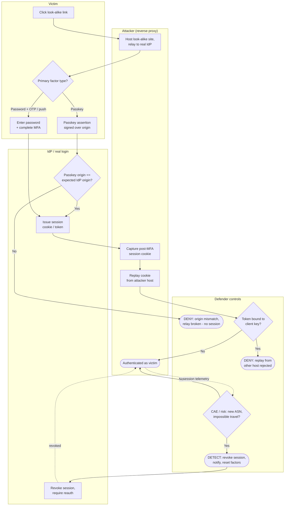

# AiTM MFA Phishing — Swimlane Diagram

Lanes for Attacker, Victim, IdP, and Defender controls. Solid arrows are the relay/replay path;
dashed arrows into the Defender lane are risk signals and eviction.

Notes

- The victim's MFA is genuine and relayed, so the fork that matters is `V2`: an **origin-bound
  passkey** (`I1`) prevents the login from completing at all.
- If a bearer cookie is issued, **token binding** (`D2`) blocks replay from the attacker's host;
  otherwise **CAE/risk** (`D4`) evicts the replayed session.
- Containment is **session revocation** (`I3`), because the stolen artifact is a live session, not
  a password.
