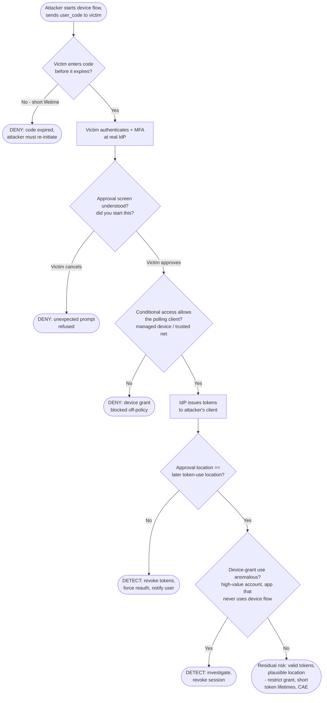

# Device Code Phishing — Decision Flowchart

Where each control forces a **deny** (prevention) or **detect** terminal. The verification page
and login are always legitimate — so defense depends on policy, code expiry, and approval
context, not on spotting a fake site.

Notes

- The strongest prevention is **not offering the device grant where it is not needed**
  (`CAQ`) plus **short `user_code` lifetimes** (`ExpQ`) — both shrink or close the window before
  detection is even required.
- A clear, verified **approval context** (`CtxQ`) turns the victim into a control: an informed
  user cancels an unsolicited code.
- The `Gap` terminal is honest about residual risk: if the attacker polls from a location similar
  to the victim's and uses a normal app, behavioral detection may miss it — hence continuous
  access evaluation and short token lifetimes to limit exposure.
