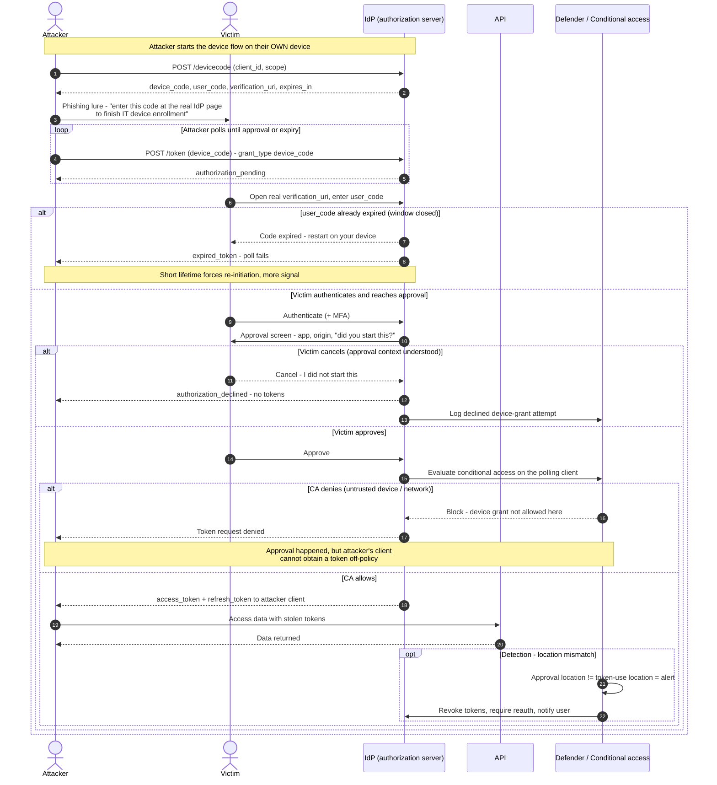

# Device Code Phishing — Sequence Diagram

The attack path (attacker initiates the device flow, lures the victim to enter the code at the
real IdP), then the defenses that block it (conditional access) or shrink and expose it (short
code lifetime, approval context). The **Attacker** is the polling client that collects the tokens.

Notes

- The victim only ever touches the **real** IdP, so fake-page and URL-reputation defenses do not
  apply — the tokens go to the attacker's pre-started polling client.
- Prevention is **conditional access** on the device grant and **short code lifetimes**;
  detection is **location/context mismatch** between approval and later token use.
- MFA is completed by the victim, so MFA alone does not stop this; a phishing-resistant approval
  context and policy restriction do.
