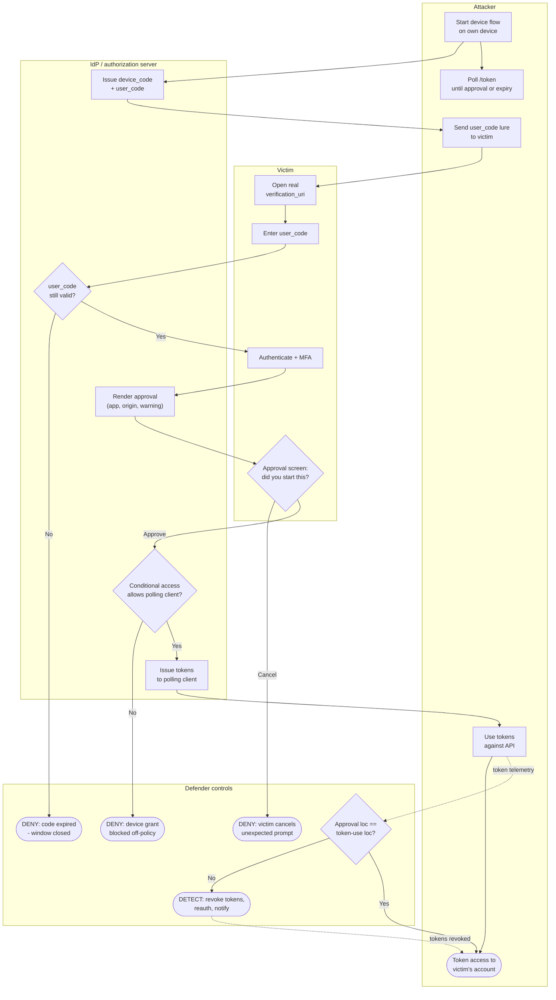

# Device Code Phishing — Swimlane Diagram

Lanes for Attacker, Victim, IdP, and Defender controls. Solid arrows are the attack path; dashed
arrows into the Defender lane are policy evaluation and detection signals.

Notes

- The Victim never sees a fake page — every step is at the legitimate IdP — so the defenses live
  in **policy** (`I4`), **code lifetime** (`I2`), and **approval clarity** (`V4`).
- Outright prevention is `I2 --> No`, `V4 --> Cancel`, or `I4 --> No`; past `I5` the response is
  detection and token revocation on a location mismatch (`D4`).
- Tokens are delivered to the attacker's polling client, not the victim's browser — the hallmark
  of this flow abuse.
