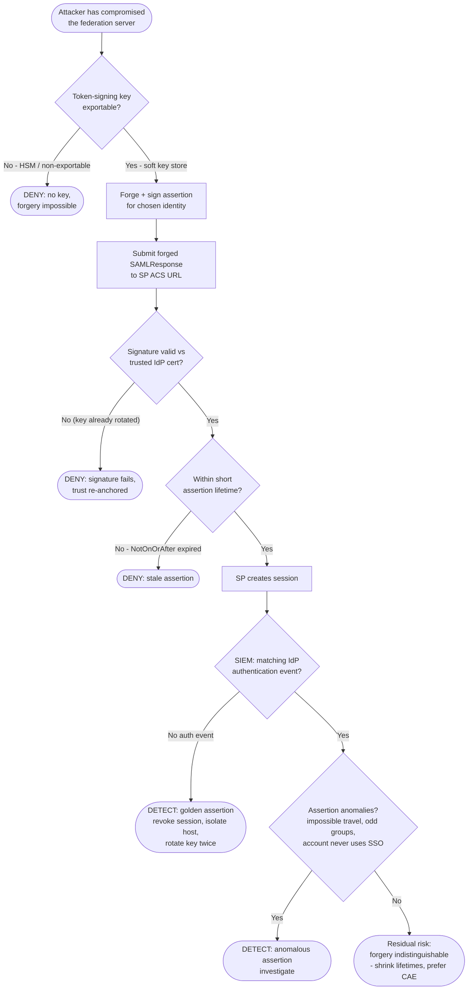

# Golden SAML — Decision Flowchart

Where each control forces a **deny** (prevention) or **detect** terminal. The signature
gate always passes for a forgery — so detection depends on log correlation, not crypto.

Notes

- The **signature gate never stops a fresh forgery** — it only helps *after* key rotation
  invalidates the stolen key. That is why HSM prevention (`KeyQ`) and log correlation
  (`CorrQ`) carry the defense.
- `CorrQ` (SP success with no IdP auth) is the highest-fidelity detection and should be a
  standing SIEM rule.
- The `Gap` terminal is honest about residual risk: a perfectly-formed, short-lived forgery
  with a real-looking profile is hard to catch, which is why continuous access evaluation
  and phishing-resistant primary auth reduce reliance on static SAML trust.
