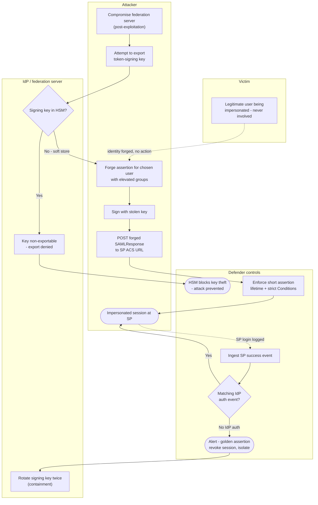

# Golden SAML — Swimlane Diagram

Lanes for Attacker, Victim, IdP, and Defender controls. The dashed arrows into the Defender
lane are the detection signals; solid arrows are the attack/forgery path.

Notes

- The Victim lane is intentionally passive: a hallmark of Golden SAML is that the real user
  takes no action and generates no IdP authentication.
- `D3` — "no matching IdP auth event" — is the core detection: SP success with no
  corresponding IdP sign-in.
- The only path that stops the attack outright is `I1 --> Yes` (HSM); everything else is
  detection and containment after a valid-looking session already exists.
