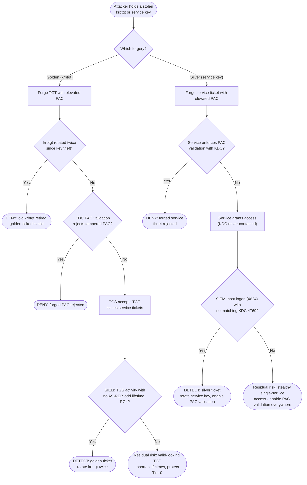

# Golden & Silver Ticket — Decision Flowchart

Where krbtgt rotation, PAC validation, and log correlation force **deny** or **detect**
terminals. A forged, correctly-encrypted ticket passes decryption — so defense is rotation,
PAC checks, and the KDC-vs-host log mismatch.

Notes

- **Golden** has a decisive prevention: `RotQ` — rotating krbtgt twice retires the key the
  forgery depends on. Absent that, PAC validation and TGS/AS-REP correlation are the fallback.
- **Silver's** signature detection is `SmonQ`: a host logon with no corresponding KDC ticket
  request, because the KDC was bypassed by design.
- The `Gap` terminals name the residual risk honestly and point to the durable fixes:
  Tier-0 key protection and universal PAC validation.
