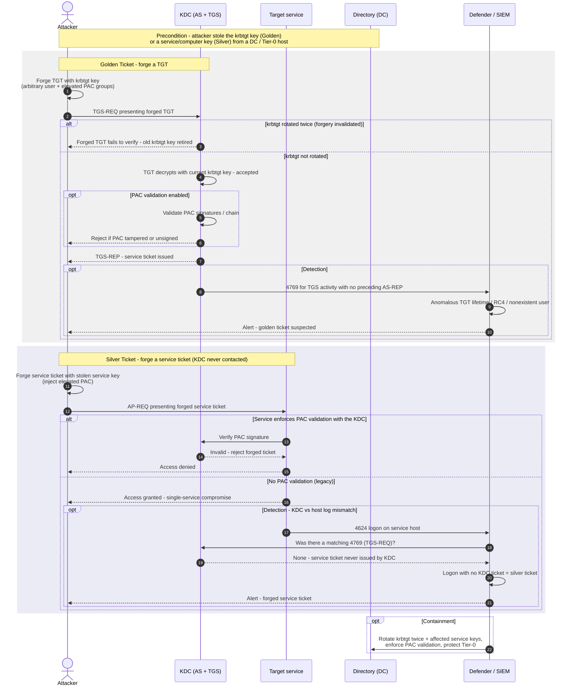

# Golden & Silver Ticket — Sequence Diagram

Two forgery paths — Golden (forged TGT from the krbtgt key) and Silver (forged service
ticket from a service key) — each followed by the defense that thwarts or detects it. The
**Attacker** already holds the stolen key; no legitimate authentication precedes the forgery.

Notes

- **Golden** forges a TGT (krbtgt key) and is redeemed at the TGS — see
  [as-exchange](../../authentication/kerberos/as-exchange/README.md) and
  [tgs-exchange](../../authentication/kerberos/tgs-exchange/README.md).
- **Silver** forges a service ticket (service key) and is presented straight to the service —
  see [ap-exchange](../../authentication/kerberos/ap-exchange/README.md). The KDC never sees it, so its logs
  won't show a 4769; that absence is the detection.
- Rotating krbtgt **twice** is what actually invalidates existing golden tickets; PAC
  validation defeats forged privilege claims in both variants.
