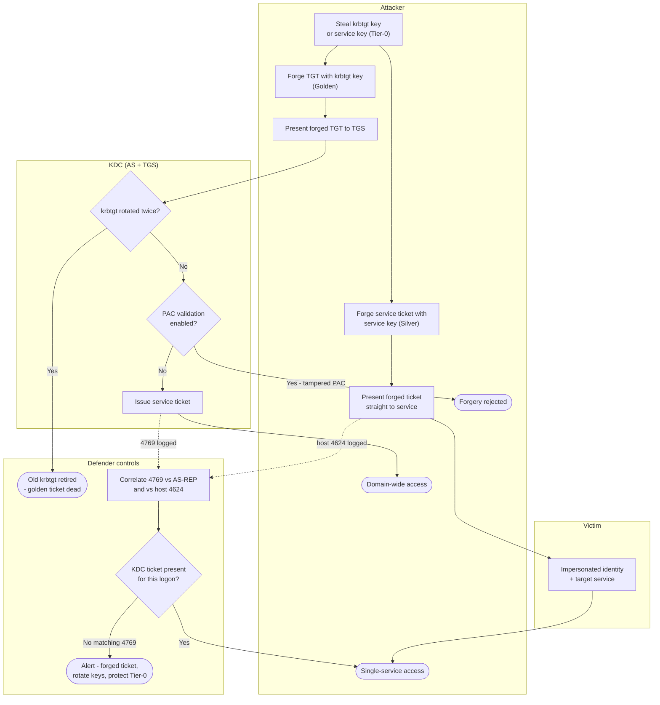

# Golden & Silver Ticket — Swimlane Diagram

Lanes for Attacker, Victim, KDC, and Defender controls. The Golden path traverses the KDC;
the Silver path bypasses it (dashed to the KDC only for PAC validation / log correlation).

Notes

- **Golden** flows through `K1`/`K2` at the KDC; a double krbtgt rotation (`K1 --> Yes`) is the
  clean kill, and PAC validation (`K2`) rejects tampered privilege claims.
- **Silver** reaches the service without touching the KDC, so `D3` — "host logon with no
  matching KDC 4769" — is the defining detection.
- Both variants end in containment: rotate the compromised keys and protect Tier-0 so the
  keys can't be re-stolen.
