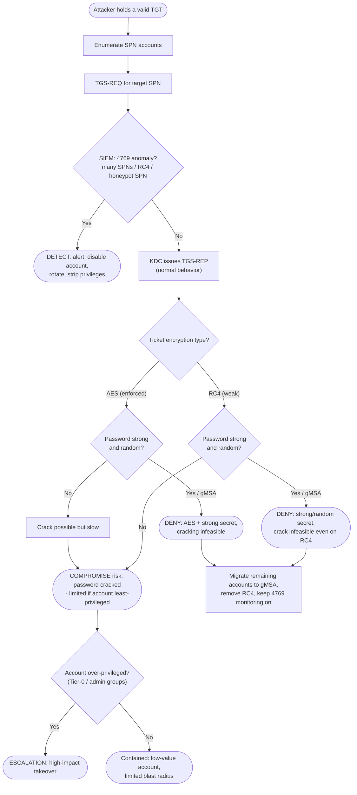

# Kerberoasting — Decision Flowchart

Where password strength, encryption type, and monitoring force a **detect** or **deny**
terminal. The ticket is always issued — defense lives after issuance.

Notes

- **`MonQ` first:** detection at request time (event 4769, honeypot SPN) can catch the roast
  before any crack completes, regardless of password strength.
- The two `Deny` terminals show the neutralizing controls: a gMSA or long random secret makes
  the offline crack infeasible; **AES-only** removes the cheap-RC4 shortcut.
- The `PrivQ` branch is why **least privilege** matters even when a weak account is cracked —
  it bounds the blast radius.
