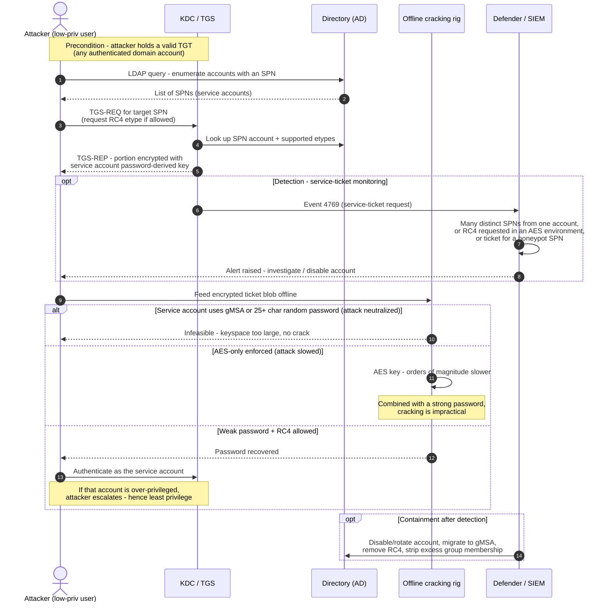

# Kerberoasting — Sequence Diagram

The attack path (request SPN tickets, crack offline), then the defenses: gMSA/strong
passwords make cracking infeasible, AES-only slows it, and 4769 monitoring / honeytokens
detect the request pattern. The **Attacker** is a low-privileged but authenticated user.

Notes

- Steps 3–5 are exactly the normal TGS request from
  [kerberos/tgs-exchange](../../kerberos/tgs-exchange/README.md); nothing is malformed —
  the abuse is intent plus volume plus offline attack.
- The cracking step is **offline**: no traffic to the KDC, which is why event 4769 at
  request time is the practical detection point, not a failed logon.
- gMSA (first `alt` branch) is the neutralizing control; AES-only slows; monitoring detects.
