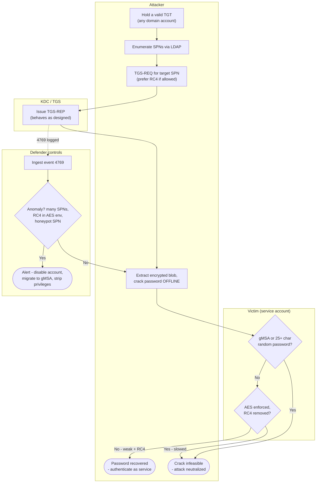

# Kerberoasting — Swimlane Diagram

Lanes for Attacker, Victim (service account), KDC, and Defender controls. Dashed arrows are
detection signals; the offline crack happens entirely inside the Attacker lane.

Notes

- The Victim lane is a pair of **posture gates**: strong/managed password and AES-only. Pass
  both and the crack fails even though the ticket was issued normally.
- The KDC lane does exactly one thing — issue the ticket — underscoring that the protocol
  itself is not the vulnerability.
- `D2` (event-4769 anomaly, especially a honeypot-SPN hit) is the detection path that runs in
  parallel with the offline crack.
