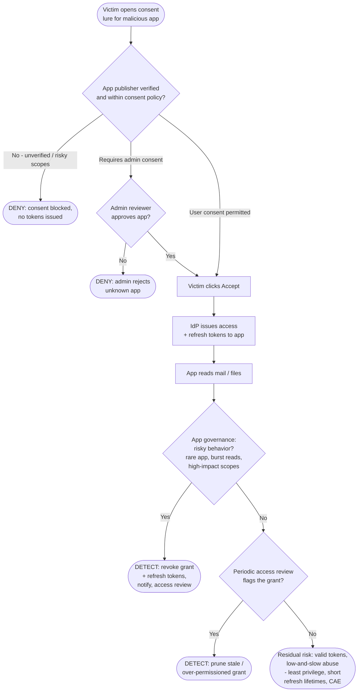

# OAuth Consent Phishing — Decision Flowchart

Where each control forces a **deny** (prevention) or **detect** terminal. The login and token
issuance are always valid — so defense depends on consent policy and app governance, not crypto.

Notes

- The **consent gate** (`PubQ` / `AdmQ`) is the strongest prevention: keep unverified and
  broadly-scoped apps from ever reaching a grantable screen.
- After tokens are issued, defense shifts to **app governance** (`GovQ`) revoking the grant —
  password resets do nothing because no password was stolen.
- The `Gap` terminal is honest about residual risk: a low-volume, well-scoped malicious app can
  evade behavioral detection, which is why least-privilege consent and continuous access
  evaluation reduce reliance on catching it after the fact.
